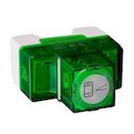

*To contribute to this page, edit the following
[file](https://github.com/Koenkk/zigbee2mqtt.io/blob/master/docs/devices/41EPBDWCLMZ_354PBDMBTZ.md)*

# Schneider Electric 41EPBDWCLMZ/354PBDMBTZ

| Model | 41EPBDWCLMZ/354PBDMBTZ  |
| Vendor  | Schneider Electric  |
| Description | Wiser 40/300-Series Module Dimmer |
| Exposes | light (state, brightness), ballast_minimum_level, ballast_maximum_level, linkquality |
| Picture |  |

## Notes

### Device type specific configuration
*[How to use device type specific configuration](../information/configuration.md)*

* `transition`: Controls the transition time (in seconds) of on/off, brightness,
color temperature (if applicable) and color (if applicable) changes. Defaults to `0` (no transition).
Note that this value is overridden if a `transition` value is present in the MQTT command payload.


## Exposes

### Light 
This light supports the following features: `state`, `brightness`.
- `state`: To control the state publish a message to topic `zigbee2mqtt/FRIENDLY_NAME/set` with payload `{"state": "ON"}`, `{"state": "OFF"}` or `{"state": "TOGGLE"}`. To read the state send a message to `zigbee2mqtt/FRIENDLY_NAME/get` with payload `{"state": ""}`.
- `brightness`: To control the brightness publish a message to topic `zigbee2mqtt/FRIENDLY_NAME/set` with payload `{"brightness": VALUE}` where `VALUE` is a number between `0` and `254`. To read the brightness send a message to `zigbee2mqtt/FRIENDLY_NAME/get` with payload `{"brightness": ""}`.

#### Transition
For all of the above mentioned features it is possible to do a transition of the value over time. To do this add an additional property `transition` to the payload which is the transition time in seconds.
Examples: `{"brightness":156,"transition":3}`, `{"color_temp":241,"transition":1}`.

#### Moving/stepping
Instead of setting a value (e.g. brightness) directly it is also possible to:
- move: this will automatically move the value over time, to stop send value `stop` or `0`.
- step: this will increment/decrement the current value by the given one.

The direction of move and step can be either up or down, provide a negative value to move/step down, a positive value to move/step up.
To do this send a payload like below to `zigbee2mqtt/FRIENDLY_NAME/set`

**NOTE**: brightness move/step will stop at the minimum brightness and won't turn on the light when it's off. In this case use `brightness_move_onoff`/`brightness_step_onoff`
````js
{
  "brightness_move": -40, // Starts moving brightness down at 40 units per second
  "brightness_move": 0, // Stop moving brightness
  "brightness_step": 40 // Increases brightness by 40
}
````

### Ballast_minimum_level (numeric)
Specifies the minimum light output of the ballast.
Value can be found in the published state on the `ballast_minimum_level` property.
To read (`/get`) the value publish a message to topic `zigbee2mqtt/FRIENDLY_NAME/get` with payload `{"ballast_minimum_level": ""}`.
To write (`/set`) a value publish a message to topic `zigbee2mqtt/FRIENDLY_NAME/set` with payload `{"ballast_minimum_level": NEW_VALUE}`.
The minimal value is `1` and the maximum value is `254`.

### Ballast_maximum_level (numeric)
Specifies the maximum light output of the ballast.
Value can be found in the published state on the `ballast_maximum_level` property.
To read (`/get`) the value publish a message to topic `zigbee2mqtt/FRIENDLY_NAME/get` with payload `{"ballast_maximum_level": ""}`.
To write (`/set`) a value publish a message to topic `zigbee2mqtt/FRIENDLY_NAME/set` with payload `{"ballast_maximum_level": NEW_VALUE}`.
The minimal value is `1` and the maximum value is `254`.

### Linkquality (numeric)
Link quality (signal strength).
Value can be found in the published state on the `linkquality` property.
It's not possible to read (`/get`) or write (`/set`) this value.
The minimal value is `0` and the maximum value is `255`.
The unit of this value is `lqi`.

