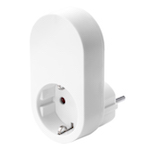

*To contribute to this page, edit the following
[file](https://github.com/Koenkk/zigbee2mqtt.io/blob/master/docs/devices/E1603_E1702_E1708.md)*

# IKEA E1603/E1702/E1708

| Model | E1603/E1702/E1708  |
| Vendor  | IKEA  |
| Description | TRADFRI control outlet |
| Exposes | switch (state), power_on_behavior, linkquality |
| Picture |  |

## Notes


The TRADFRI control outlet also acts as a Zigbee router.


### Pairing
To factory reset the TRADFRI control outlet, press and hold the reset button
(pinhole underneath the light, located at the top (bottom if UK) of the outlet) with a
paperclip until the white light starts fading. Hold onto the button for a
few more seconds, then release. After this, the outlet will automatically connect.


## OpenHAB configuration
You have to enable attribute output. Via configuration.yaml in Zigbee2MQTT.

### Item


```yaml
Switch      GF_NameDevice_Button_Press              "NameDevice"                     <button>            (GF_Room, gButton)     ["Button"]      {channel="mqtt:topic:MQTTBroker:NameDevice:state"}
Number      GF_NameDevice_Button_Link               "Link"                 <link>              (gButton)                       ["link"]        {channel="mqtt:topic:MQTTBroker:NameDevice" }
String      GF_NameDevice_Button_update_available  "Update[%s]"      <icon>            (gButton)              ["update_available"]     {channel="mqtt:topic:MQTTBroker:NameDevice:update_available"}
```


### Thing


```yaml
    Thing topic NameDevice "NameDevice" {
        Channels:
            Type switch : state "state" [ stateTopic = "zigbee2mqtt/NameDevice/state", commandTopic = "zigbee2mqtt/NameDevice/set/state", on="ON", off="OFF" ]
            Type string : update_available "update_available"     [ stateTopic="zigbee2mqtt/NameDevice/update_available"] //It shows only if an update is available
            Type number : linkquality      "linkquality"     [ stateTopic="zigbee2mqtt/NameDevice/linkquality" ]
```



## OTA updates
This device supports OTA updates, for more information see [OTA updates](../information/ota_updates.md).


## Exposes

### Switch 
The current state of this switch is in the published state under the `state` property (value is `ON` or `OFF`).
To control this switch publish a message to topic `zigbee2mqtt/FRIENDLY_NAME/set` with payload `{"state": "ON"}`, `{"state": "OFF"}` or `{"state": "TOGGLE"}`.
To read the current state of this switch publish a message to topic `zigbee2mqtt/FRIENDLY_NAME/get` with payload `{"state": ""}`.

### Power_on_behavior (enum)
Controls the behaviour when the device is powered on.
Value can be found in the published state on the `power_on_behavior` property.
To read (`/get`) the value publish a message to topic `zigbee2mqtt/FRIENDLY_NAME/get` with payload `{"power_on_behavior": ""}`.
To write (`/set`) a value publish a message to topic `zigbee2mqtt/FRIENDLY_NAME/set` with payload `{"power_on_behavior": NEW_VALUE}`.
The possible values are: `off`, `previous`, `on`.

### Linkquality (numeric)
Link quality (signal strength).
Value can be found in the published state on the `linkquality` property.
It's not possible to read (`/get`) or write (`/set`) this value.
The minimal value is `0` and the maximum value is `255`.
The unit of this value is `lqi`.

